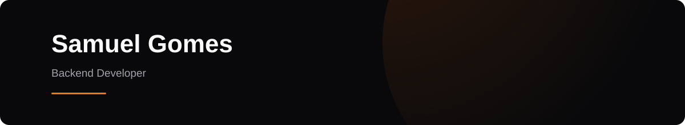

<p align="center">
  
</p>

<p align="center">
  Backend developer focused on <strong>Java and Spring Boot</strong>, building APIs and backend systems while exploring messaging, testing and software architecture.
</p>

<p align="center">
  Information Technology student • Open to Backend Intern / Junior opportunities
</p>

---

## About me

I'm an Information Technology student focused on **backend development with Java and Spring Boot**. I enjoy building APIs and understanding the engineering decisions behind reliable backend systems, especially around software architecture, databases, testing, messaging and distributed systems.

I'm currently developing **EventFlow**, where I'm progressively exploring concepts such as asynchronous messaging, concurrency, transactional events and messaging resilience. I also developed **GymFlow**, a full-stack platform for gym, trainer and workout management.

My current goal is to continue developing my backend engineering skills while preparing for opportunities as a **Backend Intern or Junior Developer**.

---

## 🛠️ Tech Stack

<p align="center">
  
  
  
  
  
  
</p>

<p align="center">
  
  
  
  
  
</p>

### Also worked with

<p>
  
  
  
</p>

---

## Currently Learning

<p align="center">
  
  
  
  
  
  
  
</p>

<p align="center">
  Exploring these concepts progressively through the development of <strong>EventFlow</strong>.
</p>

---

## 🚀 Featured Projects

### EventFlow

Event management and registration platform built to explore backend engineering concepts beyond basic CRUD applications.

**Java · Spring Boot · PostgreSQL · Docker · RabbitMQ**

Current areas of development include:

- Authentication and authorization
- Event and registration management
- Transaction management
- Concurrent seat reservations
- Pessimistic locking
- Asynchronous messaging
- Transactional event publishing
- Messaging resilience
- Integration testing

➡️ [EventFlow Backend](https://github.com/EventFlow-BR/eventflow-api)

---

### GymFlow

Full-stack platform for managing gyms, trainers, students and workout routines.

**Java · Spring Boot · PostgreSQL · React · TypeScript**

Main concepts:

- REST APIs
- JWT authentication using HttpOnly cookies
- Role-based authorization
- Organization-based access control
- Exercise and workout management
- Automated tests
- Frontend and backend integration

➡️ [GymFlow Organization](https://github.com/GymFlow-BR)

---

## Current Focus

```text
Backend Engineering
├── Java & Spring ecosystem
├── REST API design
├── PostgreSQL & data modeling
├── Automated testing
├── Messaging & event-driven systems
├── Concurrency & transactions
├── Caching
├── Observability
├── CI/CD
└── Containers & Cloud
```

---

## Connect with me

[](https://www.linkedin.com/in/samuel-gomes-928151363)
[](mailto:skgomes06@gmail.com)
